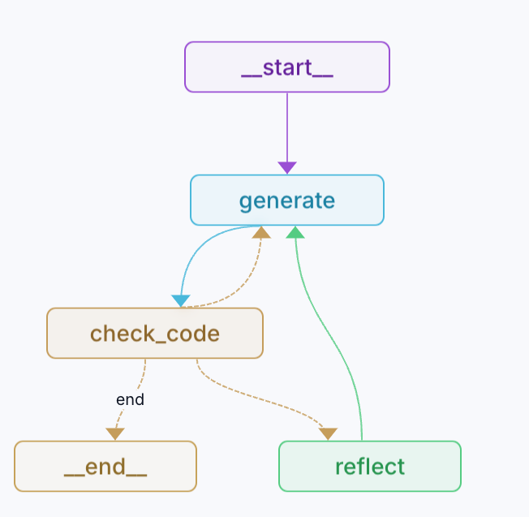

# Dev Rel Engineer

This is a an AI Agent that allows you to ask questions and generate code for your use cases for any Open Source project. This agent is built using the LangGraph.

## ToDo
- Add RAG ingestion of Docs
- Can do node becomes an agent that has 3 tools google search, github discussions/issue search and docs/code search
- Subsume develyn bot within this
- Add responding via bot as tool
- Add referencing of docs in answer given
- Add logging to this using logfire or something
- Ask agent to update state to reflect usage analytics
- Agent also acts as a product analytics tool

## Done
- Add a Can I do this Node
- Add code executor
- Remove Reflection node